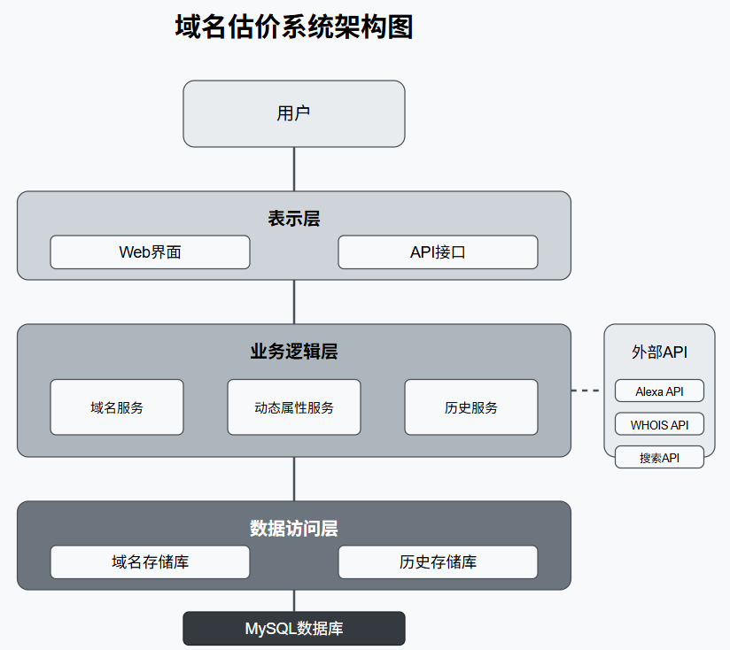

# 域名估价系统 (Domain Valuation System)

基于 Golang 和 MySQL 的专业域名估价系统，提供 Web 界面，允许用户输入域名并查询其评估价格、品相等级及详细说明。系统根据域名基础属性和动态属性综合评估域名价值，为域名交易、投资和品牌建设提供参考依据。


## 功能特点

- **专业估价算法**：基于"三个C评估法"(Characters、Commerce、.Com)的专业估价算法
- **实时动态属性**：获取Alexa排名、搜索量、相关域名注册状态等实时数据
- **多维度分析**：从基础属性、市场指标、商业价值等多个维度分析域名价值
- **详细估价报告**：提供详细的估价报告，包括各因素对估价的具体影响
- **历史记录追踪**：保存查询历史记录，方便用户回顾和比较
- **双重接口**：同时提供Web界面和API接口，满足不同场景需求
- **响应式设计**：支持PC和移动端，随时随地进行域名估价

## 系统架构

### 技术栈

- **后端**：Golang + Gin 框架
- **数据库**：MySQL
- **前端**：HTML/CSS/JavaScript + Bootstrap 5
- **缓存**：内存缓存（可扩展为Redis）

### 架构设计

系统采用经典的三层架构：

1. **表示层**
   - Web界面：基于Bootstrap 5的响应式设计
   - API接口：RESTful API设计

2. **业务逻辑层**
   - 域名服务：处理域名解析和估价核心逻辑
   - 动态属性服务：获取和处理实时动态数据
   - 历史服务：管理查询历史记录

3. **数据访问层**
   - 域名存储库：管理域名属性和估价规则
   - 历史存储库：管理查询历史记录

### 系统组件



```
domainweb/
├── cmd/                  # 命令行入口
├── config/               # 配置文件
├── internal/             # 内部包
│   ├── api/              # API处理器
│   ├── model/            # 数据模型
│   ├── service/          # 业务逻辑
│   └── repository/       # 数据访问层
├── scripts/              # SQL脚本和其他辅助脚本
└── web/                  # 前端资源
    ├── static/           # 静态资源(CSS, JS)
    └── templates/        # HTML模板
```

## 快速开始

### 前置条件

- Go 1.16 或更高版本
- MySQL 5.7 或更高版本

### 安装步骤

1. 克隆仓库

```bash
git clone https://github.com/yourusername/domainweb.git
cd domainweb
```

2. 初始化数据库

```bash
mysql -u root -p < scripts/init_db.sql
```

3. 修改数据库连接配置

编辑 `cmd/root.go` 文件中的数据库连接信息：

```go
dsn := "用户名:密码@tcp(数据库地址:3306)/domainweb?charset=utf8mb4&parseTime=True&loc=Local"
```

4. 安装依赖并运行

```bash
go mod tidy
go run main.go
```

5. 访问系统

打开浏览器访问 http://localhost:8080

## API 接口

### 域名估价

- **URL**: `/api/estimate`
- **方法**: POST
- **请求体**:
  ```json
  {
    "domain": "example.com"
  }
  ```
- **响应**:
  ```json
  {
    "domain": "example.com",
    "grade": 3.5,
    "price": 11917,
    "baseAttributes": [...],
    "otherAttributes": [...],
    "estimationDate": "2023-01-01T12:00:00Z"
  }
  ```

### 查询历史

- **URL**: `/api/history?domain=example&limit=50`
- **方法**: GET
- **参数**:
  - `domain`: 可选，按域名筛选
  - `limit`: 可选，限制返回记录数量
- **响应**:
  ```json
  [
    {
      "id": 1,
      "domain": "example.com",
      "grade": 3.5,
      "price": 11917,
      "estimationDate": "2023-01-01T12:00:00Z"
    },
    ...
  ]
  ```

## 功能详解

### 估价逻辑

系统基于以下公式计算域名价值：

- **保守估价** = 估价基数(25元) × 所有属性估价倍数的乘积
- **品相等级** = 等级基数(-0.5) + 所有属性等级增量的和

### 影响因素

#### 基础属性

| 属性类型 | 说明 | 影响范围 |
|---------|------|---------|
| 后缀 | 域名的顶级域名，如.com、.net等 | 估价×0.8~9.55，等级-0.2~+0.5 |
| 长度 | 域名的字符长度（不含后缀） | 估价×1.0~8.5，等级0~+1.0 |
| 结构 | 域名的组成结构，如纯数字、纯字母等 | 估价×0.75~1.8，等级-0.2~+0.5 |
| 注册时间 | 域名的首次注册时间 | 估价×1.0~1.5，等级0~+0.5 |
| 到期时间 | 域名的到期时间 | 估价×0.8~1.2，等级-0.2~+0.2 |

#### 动态属性

| 属性类型 | 数据来源 | 影响范围 |
|---------|---------|---------|
| Alexa排名 | Alexa API | 估价×1.0~2.5，等级0~+0.8 |
| 搜索量 | 搜索引擎API | 估价×1.0~3.0，等级0~+0.9 |
| 相关域名状态 | WHOIS API | 估价×0.65~0.9，等级-0.3~-0.1 |
| 社交媒体数据 | 社交平台API | 估价×1.0~3.7，等级0~+0.9 |
| 电商数据 | 电商平台API | 估价×1.0~1.5，等级0~+0.3 |

### 动态属性获取

系统支持实时获取多种动态属性数据：

1. **WHOIS信息**：获取域名的注册日期、到期日期和注册商信息
2. **Alexa排名**：获取域名在Alexa的全球排名
3. **搜索量数据**：获取域名相关关键词的搜索量
4. **相关域名状态**：检查相关TLD（如.net、.org等）下的域名注册状态
5. **社交媒体数据**：获取贴吧数量、百科系数、社交系数等数据
6. **电商数据**：获取淘宝商品数量等电商平台数据

> **注意**：当前版本使用模拟数据进行演示。在生产环境中，应配置相应的API密钥以获取真实数据。

## 数据库设计

系统使用MySQL数据库，主要包含以下表：

1. **domains**：存储域名基本信息
2. **domain_attributes**：存储域名属性及其对估价的影响
3. **history_records**：存储查询历史记录

详细的数据库结构请参考`scripts/init_db.sql`文件。

## 未来计划

- [ ] 集成真实API获取动态属性数据
- [ ] 添加用户认证系统
- [ ] 实现批量域名估价功能
- [ ] 添加域名价格趋势分析
- [ ] 支持更多语言和地区的域名估价
- [ ] 优化估价算法，提高准确性

## 贡献指南

欢迎贡献代码或提出建议！请遵循以下步骤：

1. Fork本仓库
2. 创建您的特性分支 (`git checkout -b feature/amazing-feature`)
3. 提交您的更改 (`git commit -m 'Add some amazing feature'`)
4. 推送到分支 (`git push origin feature/amazing-feature`)
5. 打开一个Pull Request

## 许可证

MIT

## 联系方式

- 项目维护者：[Your Name](mailto:your.email@example.com)
- 项目主页：[GitHub Repository](https://github.com/yourusername/domainweb)
